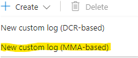
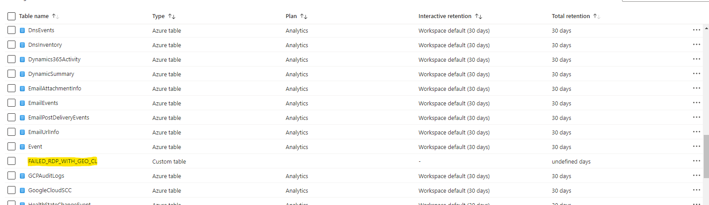

## Creating a Custom Log into the Log Analytic Workspace

We're going to create a custom log inside of our log analytics workspace which will allow us to bring that kind of custom log with the geodata into our log analytics.  

- Go back to your azure portal > Log Analytics workspace > Honeypot>Settings>Tables . 
  - 
-  Create MMA based new custom log. 
   -  
-  Copy the failed_rdp contents on to your pc to train the log analytics and import it onto your Portal 
   -  
   -  
-  In the Collection paths tab paste in the path of where the failed_rdp file is stored in your VM
   -  
-  Give a name to your Custom Log and Create
   -  
   -  
-  We can check our Logs by going to logs on the sidepanel and type in FAILED_RDP_WITH_GEO_CL and Run you should be able to see all the logs under results 
   -  
-  As you can see the Raw Data is not well organized for us to parse data and plot the graph on a map and analyze the data so before anything I am  going to write a query to parse data properly. Using the query script I could bifurcate the raw data into attributes (latitude, longitude, destination host, username,  sourcehost, country). 
   -  
   -  [Query]()
-  Save the query. 