# Log Analytic Workspace

Log Analytics is a service in Azure Monitor that enables you to collect, search, and analyze log data from various sources, including Azure resources, on-premises environments, and other cloud providers. It provides a centralized platform for monitoring, troubleshooting, and optimizing the performance and security of your applications and infrastructure. 

In this project we will use this tool to ingest logs from the virtual machine and create our own custom logs that have the geographic information so that we can discover from where the attackers are coming from. 

## Setting up Log Analytics Workspace on Azure 

- Search for Log analytics workspace. 
  - 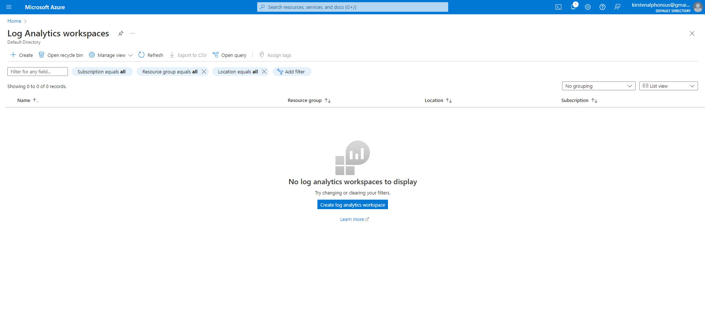
- Create log analytics workspace (this is where our logs will be stored and our SIEM will connect to this workspace to be able to display that geodata on the map.) 
  - Select the resource group that you create earlier and region according to you I am going to select West US 2 and then review and create.
    - 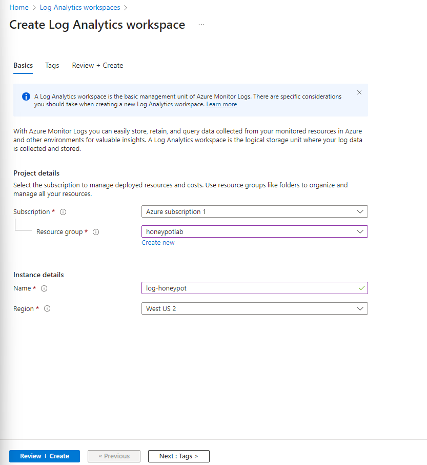
    - 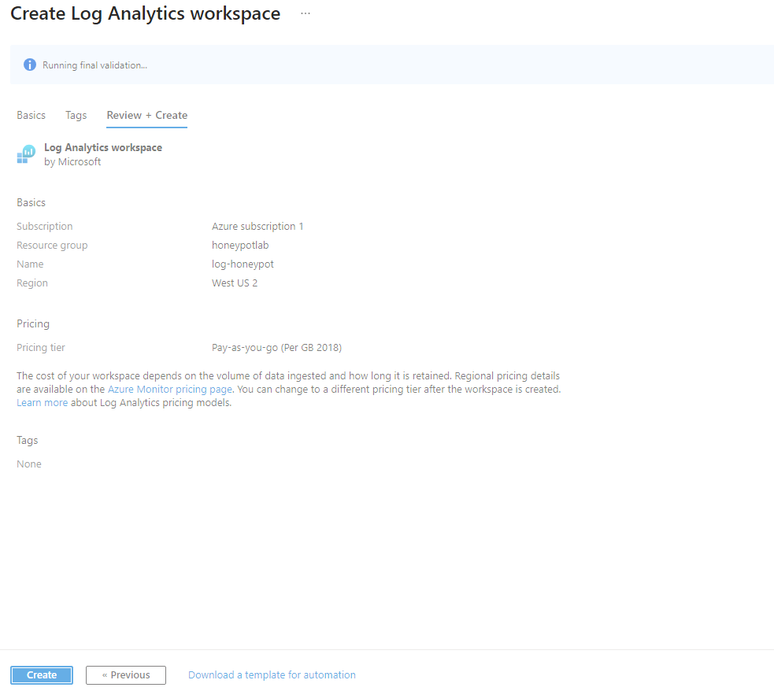
    - 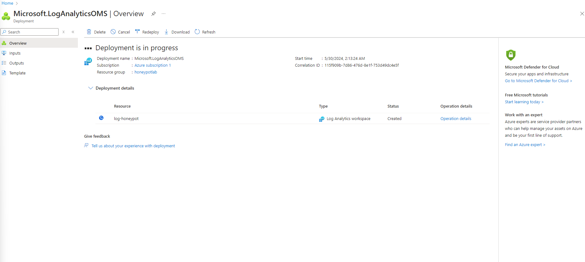
  - Search for Microsoft defender (Previously known as security center), We are going to enable the ability gather logs from the virtual machine into the log analytics workspace so once you are in the Microsoft defender go to Environment settings under management. 
    - 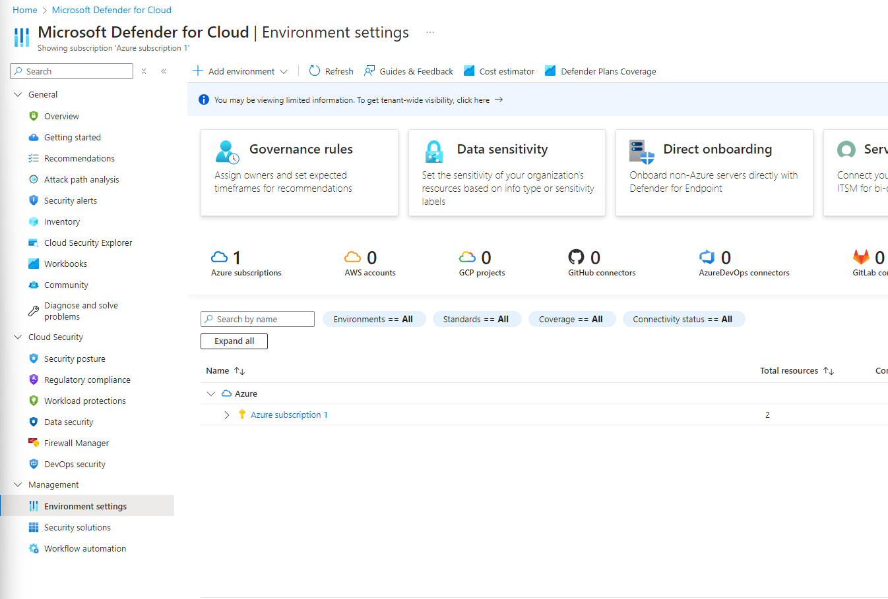
  - Click on your Azure group or subscription and select your log honey pot. 
    - 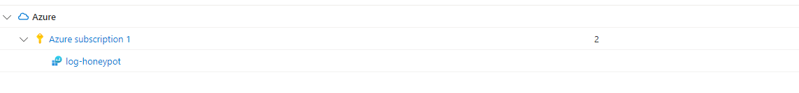
    - Turn on server plan and turn off SQL servers on machine (we don’t need it for this project) and save once you are done. 
      - 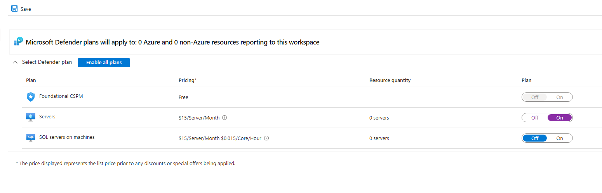
    - Click on data collection on your left and select all the events.
      - 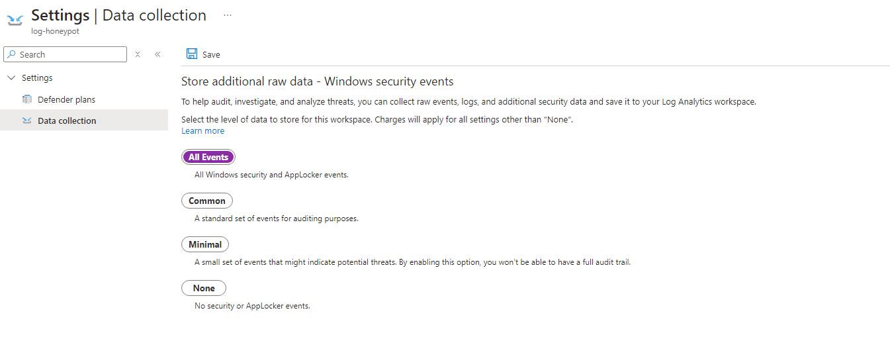
    - Now we are going to connect it to the virtual machine. Go to log analytics or search for it, go to your workspace click on Virtual machines under classic.
      - 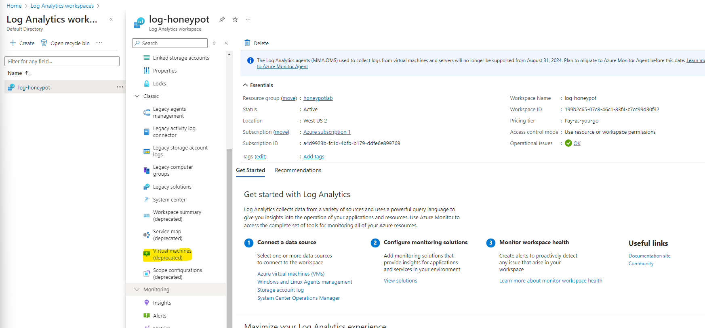
    - Select your previously created virtual machine and connect it.
      -  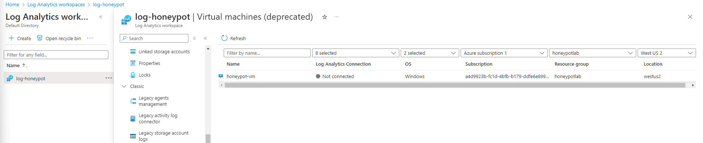
      -  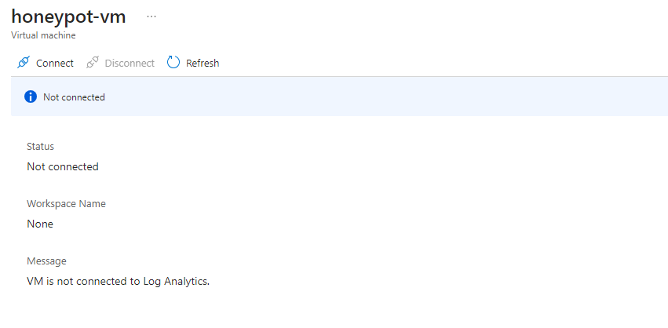
     