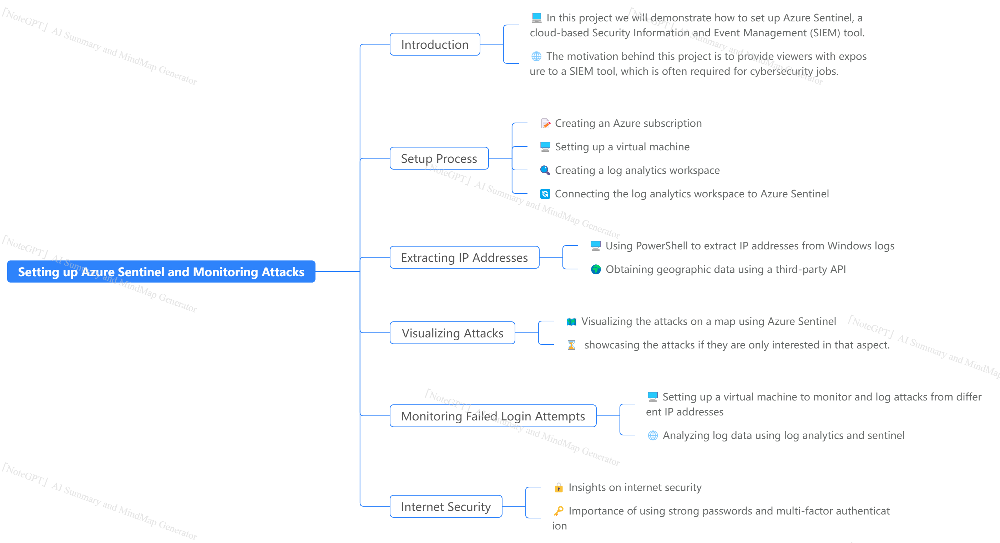

# Practical Insights into Azure Sentinel(SOC) and Honeypot/Honeynet Implementation 

This project Demonstrates how to set up Azure Sentinel, a cloud-based SIEM and a virtual machine as a honey pot and collects logs to display them in geo-graphical format.  

In this project, a small but effective honeynet was built in Microsoft Azure, with log sources integrated into a Log Analytics workspace. Microsoft Sentinel was set up to send warnings and create incidents based on the incoming logs.

- Setups/Walkthrough 
  - [Virtual Machine Setup](https://github.com/kaneki0909/SIEM-Analysis/blob/main/Virtual_Machine_Setup/Vm.md) 
  - [Log Analytics Workspace]()
  - [Sentinel Setup]() 
  - [Remote Desktop and Custom Powershell Script]()
  - [Custom Log Table integration into Log Analytic Workspace]() 
- MindMap 
  - 
- Key Insights 
  - 🔒 Importance of SIEM tools: SIEM tools like Azure Sentinel are crucial for cybersecurity jobs as they help monitor and analyze security events, enabling proactive threat detection and response.
  - 🖥️ Setting up a virtual machine: Creating a honeypot virtual machine allows capturing and analyzing attack data without risking the main system’s security.
  - 📊 Analyzing log data: Log analytics and Azure Sentinel provide powerful tools to extract and analyze log data, helping to identify patterns and potential threats.
  - 🌐 Understanding internet security: Monitoring failed login attempts from different countries highlights the importance of strong passwords and multi-factor authentication to protect against unauthorized access.
  - 🌍 Geographic data insights: Obtaining geographic data from IP addresses provides valuable insights into the origin and distribution of attacks, aiding in threat analysis and response.
  - 🗺️ Visualizing attacks: Visualizing attacks on a map using Azure Sentinel enhances situational awareness and helps identify regions with high threat activity.

- 
