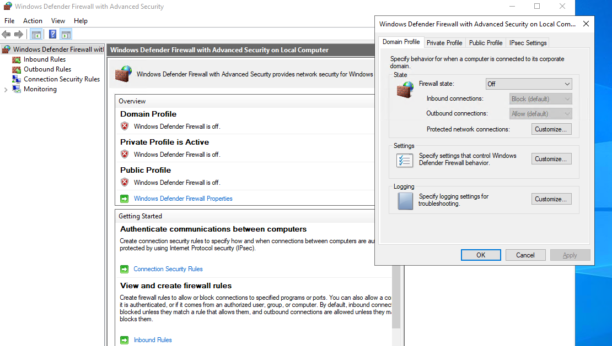

# Remote Desktop and Custom Powershell Script

Configuring our Windows machine as an open honeynet to global networks, allowing us to capture failed logs from attempted attacks. 

- Copy the public IP of your Virtual Machine.  
  -  
- Search for Remote Desktop Connection from the start menu on your local PC and run it. 
  -  
- Paste your IP into the Computer section and connect. 
  -  
- Go to more options drop down and choose "Use a different user/account". 
  -  
- Login using the credentials of your VM and accept the certificate warning 
  - 
- Inside your Virtual Machine open up Event Viewer, open Security under Windows Logs (it should take a while to load up). You should see a list of logs these are all the security events on the virtual machine. You should be able to see all the login attempts and the details. 
  - 
- Now let us try pinging the IP address of our virtual machine from our PC using command prompt. 
  - 
- Turn off the firewall on your virtual machine so that it does not block any incoming traffic so we can show or track data. To do this search for wf.msc on your virtual machine go to "Windows Defender Firewall Properties " and turn off Firewall state for Domain, private and public profiles of your virtual machine.
  - 
- Now you should see the pings take place and get receive echo requests. 
  - 
-  We will create a custom powershell script as an log exporter . Open Powershell ISE on your VM and  open a new line of code on the ISE and type in your code  and save this on your desktop.
   -  

- _Note_ : You need to get your own API key by creating an account on ipgeolocation.io. 

[Powershell Script](https://github.com/kaneki0909/SIEM-Analysis/blob/main/logexp.ps1) 

This script basically runs through the security logs of the people who failed to log in(RDP) and grabs their IP address and geo data from the Event viewer which we saw earlier and creates a new log file to a location. 

- Paste the API key as the $API_KEY value. 
  - 
- Once you run the code it will create a log report at C:\ProgramData\ (You can find this out by using run and paste the path C:\ProgramData\ you should be able to see a file called failed_rdp)  
  - 
  -  
- [RDP Failed Logs](https://github.com/kaneki0909/SIEM-Analysis/blob/main/failedrdp_log.txt)
-  We can test it out by trying to fail a log in attempt on purpose using our remote desktop 
   -  Remote Desktop > paste the IP of your virtual machine > Give invalid credentials to test the failed log on. 
      -  
   - This is what the failed log in will look like on powershell and the same will be recorded in to the failed_rdp file. 
     -  