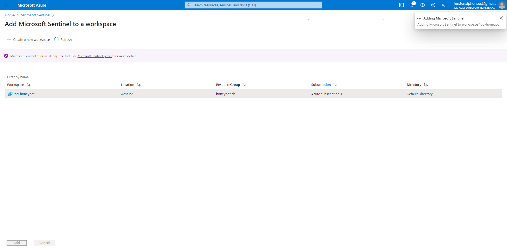

# Microsoft Azure Sentinel Setup

Azure Sentinel is a cloud-native Security Information and Event Management (SIEM) and Security Orchestration, Automation, and Response (SOAR) solution from Microsoft. It is designed to help organizations detect, investigate, and respond to threats in real-time, providing a comprehensive security operations platform.  

This is my SIEM, I am going to use this visualize the attack data.

## Sentinel Setup 
- Search for Microsoft Sentinel and create Microsoft Sentinel. Pick the log analytic workspace you created earlier and add it.  
  - 