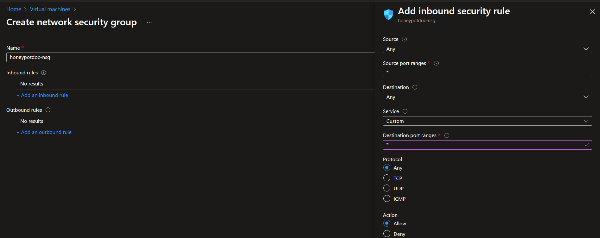
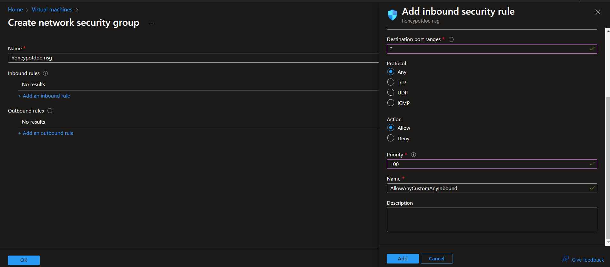

# Create a virtual machine on Azure (creating a honeypot exposed to the internet). 
- Once you have the subscription created go to https://portal.azure.com/#home and search for "Virtual Machine" in the search box.   
  - 
- Create a virtual Machine 
  - 
- Fill in the Factors for the Virtual Machine
  -   
- In the Networking part of the VM Setup we have to configure our network security group to advanced and allow all ports to be open so we can actually record attacks and failed logons. 
      
  - Under "NIC network seurity group" check the "Advanced" option and Click on "Create new" next to the "Configure network security group". (You are basically creating your own firewall)
    - 
  - Give your firewall a name and you will see a default inbound rule you will have to remove it and add a inbound rule. 
    -  
  -  Now click on "Add an inbound rule" Here is a recommended setup for an unsecure firewall and click on Add. 
     -  
     -   
  - Once that is done click on "Add" and the "ok" this is gonna allow all traffic from the internet to our virtual machine. (*the main reason for us doing this is to allow our virtual machine to be very discoverable*).
  - Click on Review and Create and then Create the Virtual Machine. 
      -   
  
