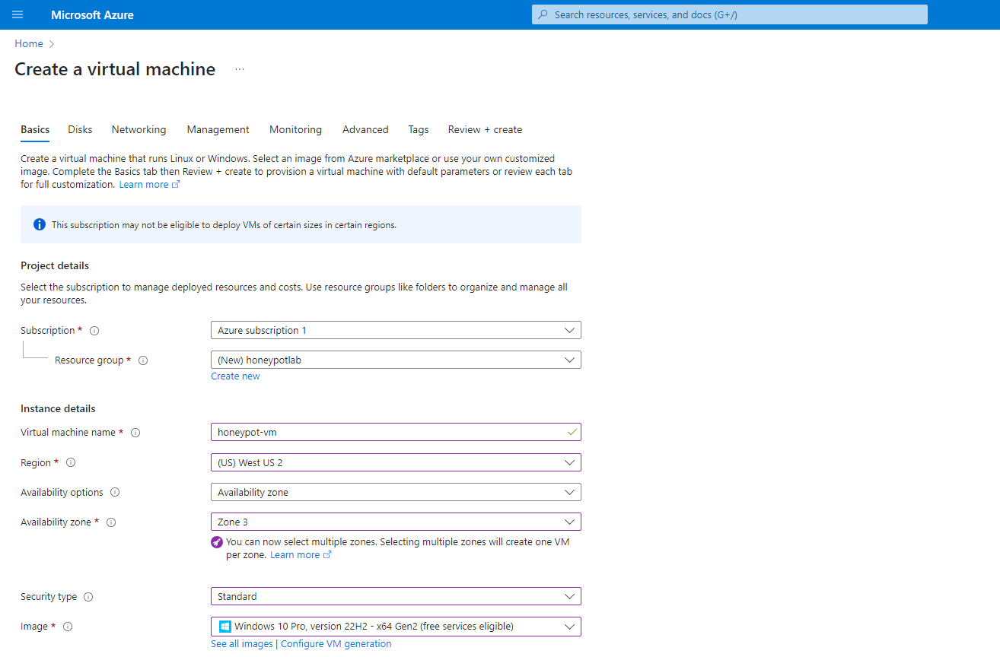
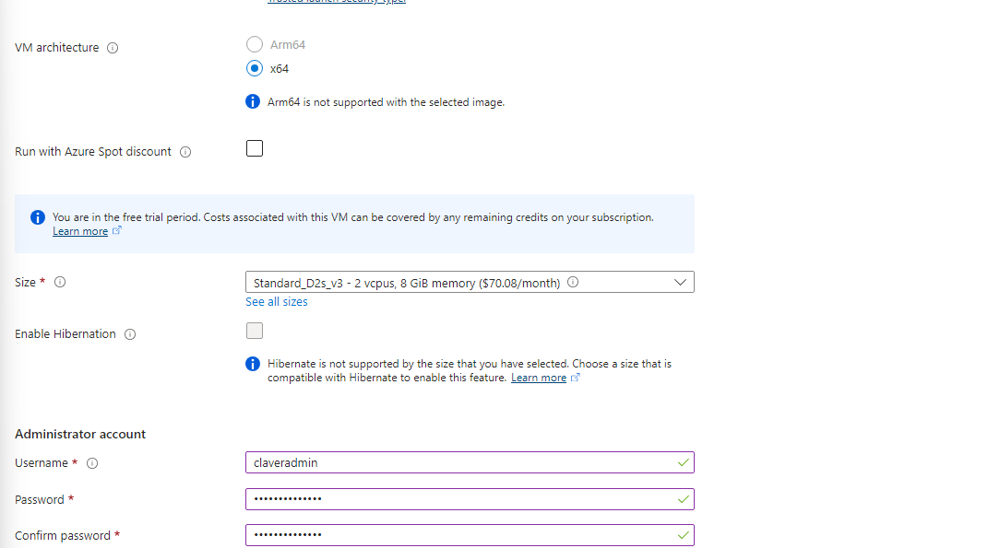
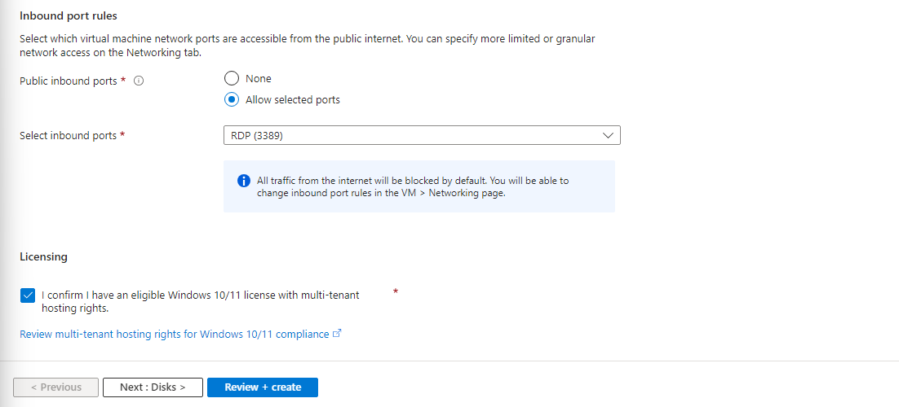
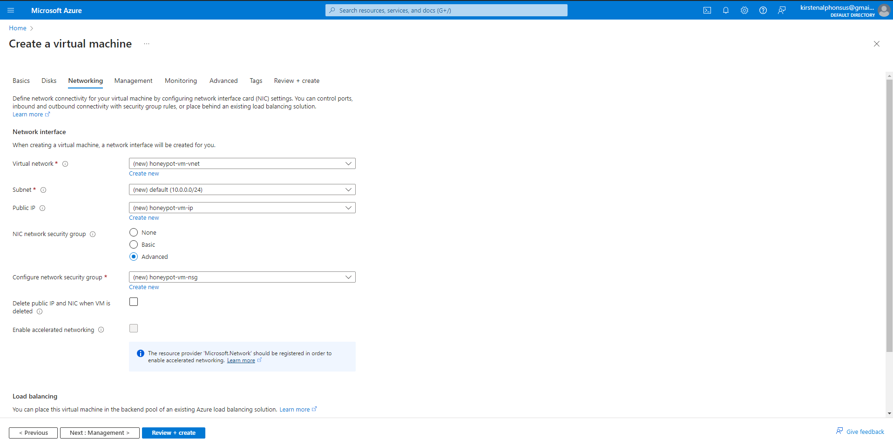
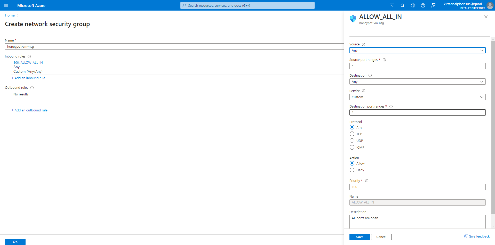
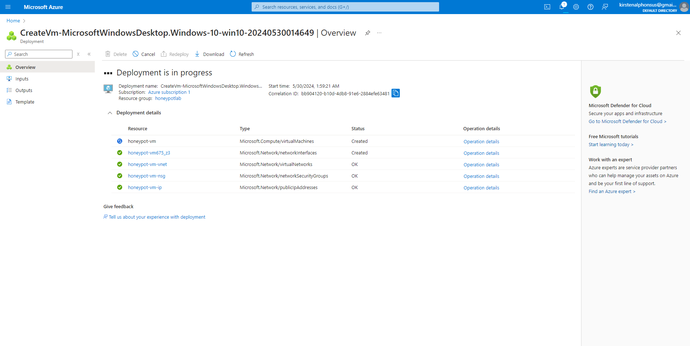

- Creating our Azure Account 
  - https://azure.microsoft.com/en-us/free/  sign in or create your free azure account. 
  - Move on to your azure portal.
  - Creating a virtual machine (this is our honeypot) that is going to be sit on the internet exposed to the attacks or logins. 
    - Create a new resource group which is basically, logically grouping of resources in azure that usually share the same lifespan. 
    - Name your virtual machine desirably, I am just going to name it honeypot. 
    - Set your virtual machine region (this is the geographic region where they exist physically )
    - Set your image and Size. 
    - Set-up your user name and password

        - 
        - 
        - 
    - Leave the Disks as default or alter it according to your needs this project will run with default disk settings for the VM.
    - Under the Networking section under the NIC network security group (this is like a firewall) we are going to select the advanced option and create a new set of rules. 
    - Before we create our own inbound rules make sure you delete the currently existing default inbound rules. (We have set up our firewall in such way that all ports are open to connections from the internet)
      - 
      - 
    - Click on review on create (The main reason we created our virtual machine this way is because we want to make our virtual machine very discoverable).
    - Click on create after.  
      - 
    - This shows that the virtual machine is being created it might take a while.