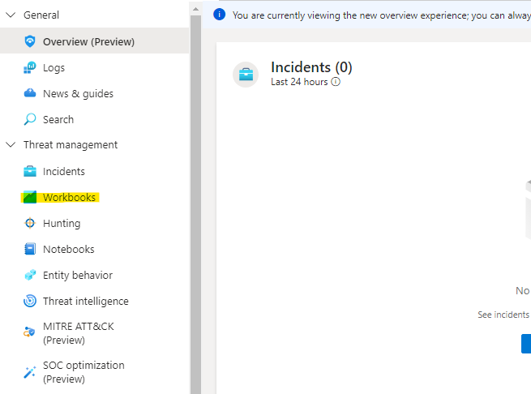
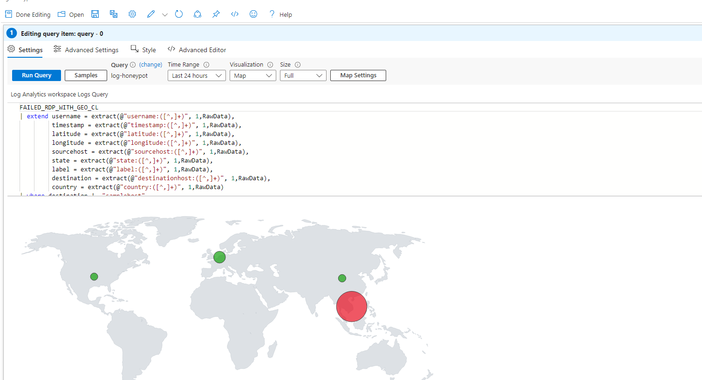
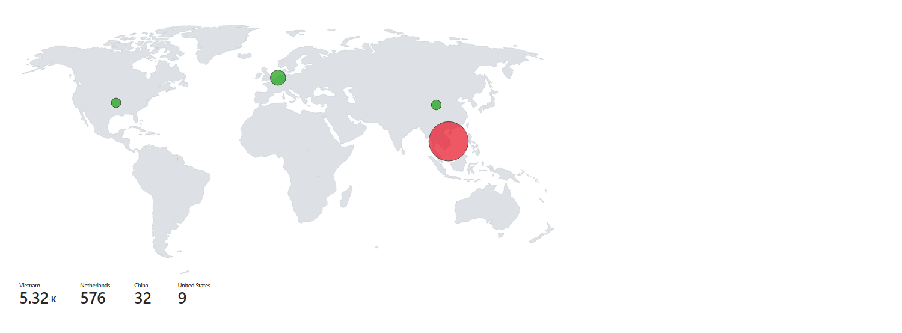

This part of the project will display the Raw data in a graphical user interface (On a Map) with analytics.  

- Open Microsoft Sentienel on the Azure Portal and select  your workspace. 
- Open Workbooks from the side panel
  - 
- Open Add workbook from the top and delete all existing work books 
- Create new workbook and paste in the query that you wrote for your log extraction and run it. 
  - 
- Apply the Map settings accordingly and apply, you should see the attacks and its metrics in real time on the Map. 
  - 